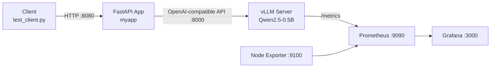

# LLM Inference — Phase 1

A self-hosted LLM inference stack built around **vLLM**, wrapped with a small **FastAPI** app, and monitored with **Prometheus + Grafana**. Everything runs via **Docker Compose**.

This phase focuses on standing up a local, CPU-friendly inference service and measuring its latency / throughput characteristics.

---

## Architecture



| Service | Container | Port | Purpose |
|---------|-----------|------|---------|
| **vllm** | `case2-vllm` | `8000` | OpenAI-compatible LLM server (Qwen2.5-0.5B-Instruct) |
| **myapp** | `case2-myapp` | `8080` | FastAPI wrapper with simple Bearer-token auth |
| **prometheus** | `case2-prometheus` | `9090` | Scrapes vLLM + node metrics |
| **grafana** | `case2-grafana` | `3000` | Dashboards for latency / throughput / KV cache |
| **node-exporter** | `case2-node-exporter` | `9100` | Host-level metrics |

---

## Prerequisites

- Docker + Docker Compose
- ~4 GB free RAM (CPU inference of a 0.5B model)
- Internet access on first run (pulls the model weights from HuggingFace)

---

## Quick Start

```bash
# 1. (Optional) set your own API key for the app's auth
export API_KEY=your-secret-key

# 2. Build & start the whole stack
docker compose up --build -d

# 3. Check that vLLM is healthy
curl http://localhost:8000/v1/models

# 4. Hit the app
curl -X POST "http://localhost:8080/ask?prompt=Hello&max_tokens=50" \
     -H "Authorization: Bearer ${API_KEY:-secret-key}"
```

> **Note:** if `API_KEY` is not set, the app falls back to the placeholder `secret-key` (see [Security](#security)).

### Stop / clean up

```bash
docker compose down          # stop
docker compose down -v       # stop + remove volumes (re-downloads model)
```

---

## Endpoints

### FastAPI app (`:8080`)

| Method | Path | Description |
|--------|------|-------------|
| `GET` | `/health` | Liveness check |
| `POST` | `/ask` | Single completion. Params: `prompt`, `max_tokens`, `temperature` |
| `POST` | `/ask-stream` | Streaming completion. Params: `prompt` |

All `/ask*` endpoints require the header `Authorization: Bearer <API_KEY>`.

### vLLM (`:8000`)

Exposes the standard OpenAI-compatible API (`/v1/models`, `/v1/chat/completions`, `/v1/completions`) plus `/metrics` for Prometheus.

---

## Clients

Two helper scripts live in `client/`:

```bash
# Load test: throughput + latency across varied traffic
python client/test_client.py

# Pull vLLM metrics and print latency / throughput / FLOPs / KV-cache usage
python client/metrics.py
```

---

## Monitoring

- **Prometheus** scrapes vLLM (`:8000/metrics`) and node-exporter (`:9100/metrics`) every 5s.
- **Grafana** is pre-provisioned with a dashboard (`grafana/dashboards/vllm.json`) showing:
  - End-to-end latency, TTFT, inter-token latency (avg + p50/p90/p99)
  - Decode rate & per-request output tokens
  - Prompt / generation token totals
  - Analytic FLOPs estimate
  - KV-cache usage

Open Grafana at `http://localhost:3000` (default login `admin` / `admin`).

---

## Configuration

| File | Purpose |
|------|---------|
| `vllm-config.yaml` | vLLM server settings (model, dtype, quantization, batching, prefix caching) |
| `docker-compose.yaml` | Service orchestration, ports, env vars, volumes |
| `app/main.py` | FastAPI wrapper + auth |
| `prometheus/prometheus.yml` | Scrape targets |
| `grafana/provisioning/` | Auto-provisioned datasource + dashboard |

Key vLLM settings in `vllm-config.yaml`:

- `model: Qwen/Qwen2.5-0.5B-Instruct`
- `dtype: bfloat16`, `quantization: awq`
- `max-model-len: 2048`
- `max-num-seqs: 16`, `max-num-batched-tokens: 2048`
- `enable-prefix-caching: true`

---

## Security

> ⚠️ This stack is intended for **local / development** use. Do not expose it directly to the public internet.

- The app's `API_KEY` defaults to the placeholder `secret-key`. **Set a real value via the `API_KEY` env var** before any non-local deployment.
- Grafana runs with the default admin credentials (`admin` / `admin`). Change `GF_SECURITY_ADMIN_PASSWORD` for any shared environment.
- vLLM's own API on `:8000` has **no authentication** — keep it behind your network / firewall.

---

## Roadmap (Phase 1 → next)

- [x] Stand up vLLM + FastAPI wrapper
- [x] Prometheus + Grafana monitoring
- [x] Load-test client & metrics script
- [ ] GPU / multi-model serving
- [ ] Production auth (OAuth / API gateway)
- [ ] Autoscaling & queue management
